# Finance Document Agent 고도화 프로젝트

> 기존 장학재단 문서 조회 에이전트를 출발점으로, **문서 적재 정확도**, **질문 분류 안정성**, **답변 신뢰성**을 단계적으로 고도화한 프로젝트

---

## 1. 프로젝트의 출발점

이 프로젝트의 출발점은 장학금·후원금·지원금·예산 명세처럼 **금액과 표가 중심인 문서**를 적재하고, 사용자가 자연어로 명단·금액·기준·절차를 조회할 수 있도록 만든 로컬 문서 질의 에이전트다.

대상 문서는 Excel, PDF, HWP/HWPX, 표 이미지이며, 문서 안에는 보통 다음과 같은 정보가 포함된다.

- 장학생·수혜자·기부자·기관 명단
- 학과, 기수, 발행번호와 같은 식별 정보
- 지급일·출연일·졸업연월과 같은 날짜 정보
- 지급액·후원액·출연금액과 같은 금액 정보
- 장학금의 목적, 지원 기준, 신청 절차와 같은 본문 정보

기존 에이전트는 문서를 단순히 한 저장소에 넣지 않는다. 표 데이터는 **Parquet**에 구조화하고, 문서 설명과 행 단위 텍스트는 **ChromaDB**에 임베딩하는 이중 저장 구조를 사용한다. 이 구조를 통해 계산과 명단 조회는 PANDAS 경로에서 처리하고, 규정·목적·절차처럼 본문 의미를 찾아야 하는 질문은 VECTOR 경로에서 처리한다.

하지만 실제 장학재단 문서를 적용하면서 세 가지 문제가 반복적으로 드러났다.

1. 문서 형식과 표 구조가 달라지면 적재 결과가 흔들렸다.
2. 질문이 조금만 모호해도 잘못된 실행 경로로 분류될 수 있었다.
3. 결과는 맞더라도 어떤 문서와 행을 사용했는지 확인하기 어려웠다.

따라서 본 프로젝트는 기존 구조를 버리고 새로 만드는 것이 아니라, 기존 에이전트를 바탕으로 다음 세 부분을 순서대로 고도화한다.

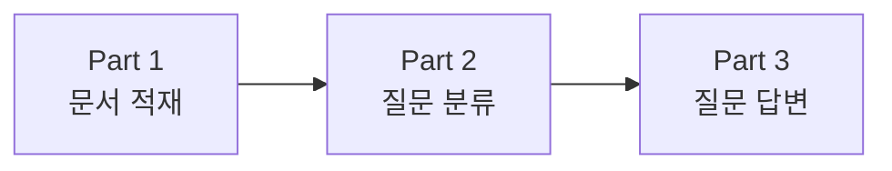

---

## 2. 기존 장학재단 문서 조회 에이전트의 동작 구조

### 2.1 문서 적재 과정

사용자가 문서를 업로드하면 먼저 파일 형식에 맞는 파서가 원본 내용을 읽는다.

- Excel은 시트별 표를 추출한다.
- PDF는 본문과 표를 분리하고, 스캔 페이지는 OCR로 보완한다.
- HWP/HWPX는 HTML 변환 후 표를 추출한다.

추출된 표는 바로 저장하지 않는다. 실제 병합 셀을 복원하고, 헤더와 데이터 행을 구분한다. 이후 표는 Parquet에 저장하고, 문서 설명과 행 텍스트는 ChromaDB에 저장한다.

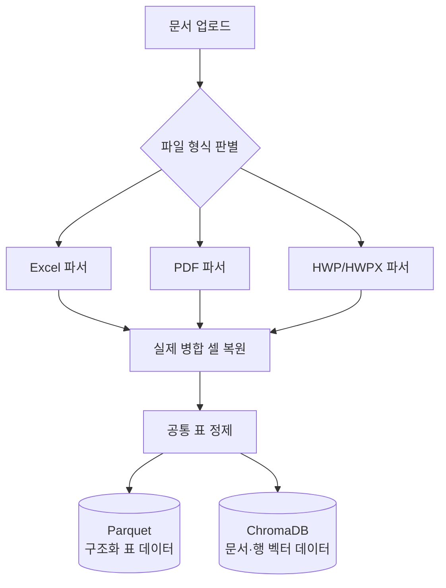

### 2.2 VECTOR 경로

VECTOR 경로는 표 계산보다 **문서의 의미와 본문 내용**을 찾는 데 사용한다.

예를 들어 다음 질문은 VECTOR 경로가 적합하다.

- 이 장학금의 지급 기준은 무엇인가?
- 신청 절차를 설명해 달라.
- 지원 대상 조건이 무엇인가?
- 이 문서의 목적을 요약해 달라.

처리 과정은 질문과 가까운 문서 청크를 ChromaDB에서 검색한 뒤, 검색된 근거만 LLM에 전달하여 답변을 생성하는 방식이다. 검색 문서에 직접 근거가 없으면 일반 지식이나 파일명 추측으로 내용을 채우지 않는 것을 원칙으로 한다.


### 2.3 PANDAS 경로

PANDAS 경로는 **표의 행과 열을 직접 조회하거나 계산해야 하는 질문**에 사용한다.

예를 들어 다음 질문은 PANDAS 경로가 적합하다.

- 홍길동의 학과를 알려 달라.
- 3월 장학생 명단을 보여 달라.
- 출연금액의 총합을 계산해 달라.
- 가장 많은 금액을 받은 사람을 알려 달라.

PANDAS 경로 안에는 두 가지 실행 방식이 있다.

1. **기본 조회**  
   이름 검색, 명단 조회, 합계, 평균, 최댓값, 최솟값처럼 자주 사용하는 질문을 검증된 전용 함수로 처리한다.

2. **코드 생성형 조회**  
   기본 조회로 처리하기 어려운 표 질문을 별도 계획으로 변환하여 실행한다. 정해진 프롬프트로 Python 코드를 LLM이 작성한다.

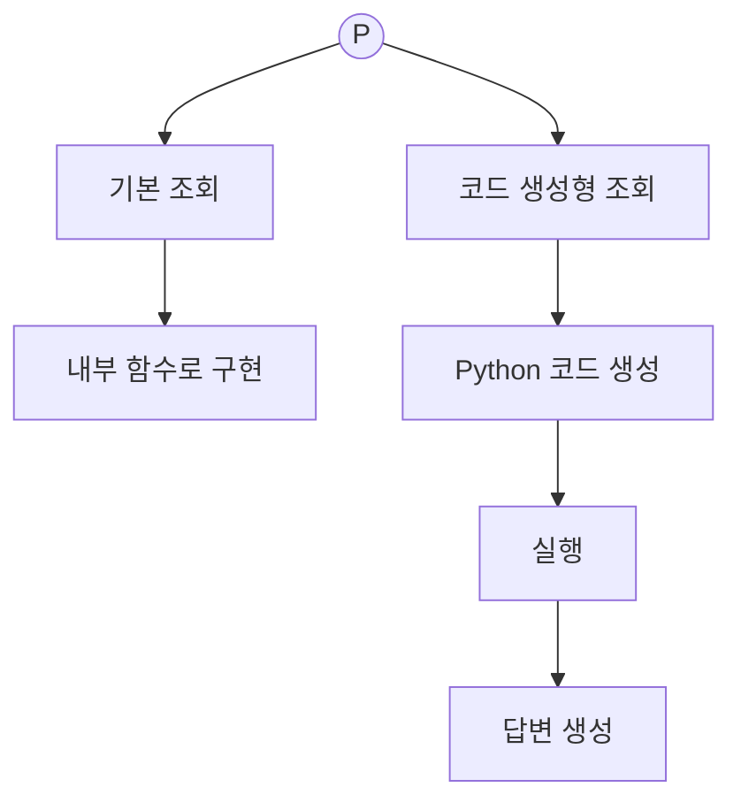

### 2.4 Router의 역할

Router는 질문을 직접 답하는 모듈이 아니라, 질문을 분석한 결과를 바탕으로 **어떤 실행 경로를 사용할지 결정하는 모듈**이다.

- 표 조회·명단·금액 계산이면 PANDAS
- 문서 목적·기준·절차 설명이면 VECTOR

이 프로젝트에서 가장 중요한 것은 Router가 PANDAS경로나 VECTOR경로 두 가지로 분기된다는 것이다. 잘못된 분기는 이후의 검색과 계산이 아무리 정확해도 오답으로 이어질 수 있다.

### 2.5 전체 사용자 흐름

아래 순서도는 사용자가 문서를 업로드한 시점부터 답변을 받기까지의 기본 흐름을 한눈에 보여 준다.

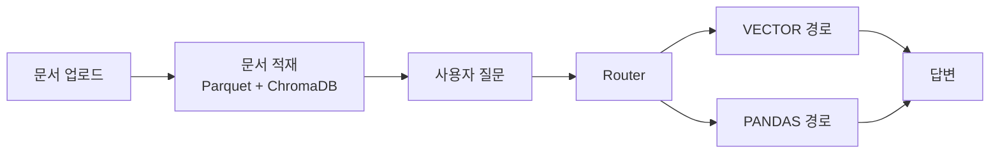

즉, **문서 업로드 → 문서 적재 → 질문 → Router 분기 → VECTOR 또는 PANDAS 처리 → 답변**이 기존 에이전트의 핵심 흐름이다.

---

## 3. 고도화 과정을 보는 기준: E1, E2, E3

본 프로젝트의 발전 과정은 기능 목록이 아니라 발표와 피드백의 흐름에 맞춰 세 시기로 구분한다.

| Era | 의미 |
|---|---|
| **E1** | 1st 발표 전까지 구현한 내용 |
| **E2** | 2nd 발표 전까지 구현한 내용 |
| **E3** | 발표 피드백 후 다음 계획 |


이제 전체 고도화 과정을 **문서 적재**, **질문 분류**, **질문 답변**의 세 Part로 나누어 설명한다.

---

# Part 1. 문서 적재 고도화

문서 적재 Part의 목표는 형식이 다른 문서가 들어오더라도 원본 표 구조를 최대한 보존하고, 이후 질문 단계에서 날짜·금액·이름을 안정적으로 사용할 수 있는 데이터로 변환하는 것이다.

## E1. 이미지 처리와 병합 셀 복원

초기 에이전트는 Excel, PDF, HWP/HWPX 중심으로 동작했기 때문에 세로로 긴 표 이미지나 스캔 자료를 직접 적재하기 어려웠다. 또한 빈칸을 모두 이전 행의 값으로 채우는 방식은 일반 공란까지 병합 셀로 오인하여 원본 값을 변형할 수 있었다.

E1에서는 이 두 문제를 우선 해결했다.

### 이미지 표 처리

OpenCV로 가로선과 세로선을 검출하여 행·열 경계를 찾고, 각 셀을 개별 이미지로 분리한 뒤 PaddleOCR로 문자를 인식하도록 구성했다. 고정된 열 개수나 특정 컬럼명을 코드에 넣지 않고, 실제 이미지에서 감지한 열 수와 첫 표 행을 기준으로 DataFrame을 생성하도록 했다.


### 병합 셀 처리

병합 셀은 단순히 빈칸이라는 이유로 복원하지 않고 파일에서 확인할 수 있는 물리적 근거를 사용하도록 변경했다.

- XLSX: 실제 병합 범위
- PDF: 셀 좌표와 표 구조
- HWP/HWPX: rowspan 정보
- 이미지: 격자선과 셀 경계

이 변경으로 일반 공란과 실제 병합 셀을 구분하고, 원본 표를 임의로 변형하는 문제를 줄였다.

## E2. 공통 스키마와 날짜 인식

E1에서 표를 읽어 오는 안정성을 높였지만, 같은 의미의 컬럼이 문서마다 다른 이름을 사용하는 문제가 남아 있었다.

예를 들어 금액 컬럼은 `지급액`, `후원액`, `출연금액`으로 다르게 표현될 수 있고, 날짜 컬럼은 `지급일`, `출연일자`, `졸업연월`, `지급월`처럼 서로 다른 정밀도를 가진다.

E2에서는 원본 컬럼명을 강제로 하나로 바꾸지 않고, 원본은 그대로 보존하면서 별도의 의미 정보를 붙이는 **공통 의미 스키마**를 추가했다.

스키마에는 다음 정보가 포함된다.

- 원본 컬럼명
- 추론된 의미
- 데이터 타입과 단위
- 날짜 정밀도
- 민감정보 여부
- 매핑 신뢰도
- 스키마 버전

특히 날짜를 하나의 타입으로 처리하지 않고 다음과 같이 구분했다.

| 원본 형태 | 스키마 의미 |
|---|---|
| `2025-03-14`, `출연일자` | `date` |
| `2025-03`, `졸업연월` | `year_month` |
| `2025`, `지급연도` | `year` |
| `3월`, `지급월` | `month` |
| `14일` | `day` |

이로써 `3월 명단`, `2025년 4월 합계`, `2024년 12월부터 2025년 2월까지`와 같은 질문을 표 구조에 맞게 처리할 기반을 만들었다.

## E3. 운영 문서 연결과 예외 구조 처리 계획

발표 피드백 이후의 E3는 새로운 기능을 무작정 추가하기보다 실제 운영 문서가 들어왔을 때 적재가 중단되지 않도록 만드는 데 초점을 둔다.

### 1. Google Sheets 연결

사용자가 파일을 매번 내려받아 업로드하지 않아도 지정된 Google Sheets 문서를 불러와 기존 Table Ingest Pipeline으로 전달하는 연결 구조를 추가할 계획이다. 불러온 데이터도 Excel과 동일하게 원본 컬럼, 공통 스키마, Parquet, ChromaDB 흐름을 사용한다.

### 2. PDF 적재 발전

현재 PDF는 본문과 표를 분리하고 스캔 페이지를 OCR로 보완하지만, 실제 문서에서는 한 페이지에 여러 표가 있거나 표 경계가 흐린 경우가 있다. E3에서는 페이지별 처리 결과와 표별 품질 정보를 남기고, 텍스트 PDF·스캔 PDF·혼합 PDF를 구분해 서로 다른 추출 전략을 적용할 계획이다.

### 3. Excel의 과도한 병합 셀 문제 처리

행과 열이 지나치게 많이 병합된 Excel은 일반적인 표 구조로 바로 변환하기 어렵다. E3에서는 병합 영역을 무조건 펼치지 않고, 제목 영역·다단 헤더·실제 데이터 영역을 먼저 분리한 뒤 데이터 영역에만 병합 복원 규칙을 적용하는 방향으로 개선한다.

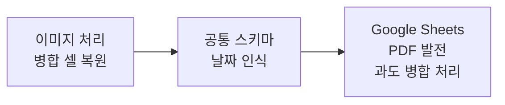

---

# Part 2. 질문 분류 고도화

질문 분류 Part는 전체 프로젝트에서 가장 중요한 부분이다. 적재된 데이터가 정확해도 질문이 잘못 분류되면 VECTOR가 계산 질문을 받거나, PANDAS가 규정 설명 질문을 받아 오답을 만들 수 있기 때문이다.

## E1. V1에서 V2.2까지: 규칙 기반 분류의 발전

### V1. 모호한 질문이 VECTOR로 들어가는 문제

#### 문제

초기 구조에서는 처리하기 어려운 질문이나 모호한 질문도 명확히 차단되지 않으면 최종적으로 VECTOR 경로로 흘러가는 경우가 있었다.

예를 들어 다음과 같은 질문이다.

- `저번 거 얼마야?`
- `그 사람 알려줘.`
- `금액이랑 규정 전부 비교해줘.`

이 질문들은 대상 문서·사람·기간이 없거나, PANDAS와 VECTOR 작업이 섞여 있다. 그러나 이를 그대로 VECTOR가 받으면 관련성이 낮은 문서를 근거처럼 사용하거나 LLM이 빈 내용을 보완하면서 할루시네이션이 발생할 수 있다.

#### 해결

Router 앞에 Guard와 Guide를 추가했다.

- **Guard**는 질문을 실행해도 되는지 검사한다.
- **Guide**는 실행할 수 없는 질문을 사용자가 다시 작성할 수 있도록 안내한다.

Guard는 다음 질문을 감지한다.

- VECTOR와 PANDAS가 섞인 복합 질문
- 너무 짧아 대상을 확인할 수 없는 질문
- 문서명·사람·기간·금액 대상이 불명확한 질문
- 현재 지원하지 않는 요청

이 구조를 통해 위험한 질문을 임의로 VECTOR에 보내는 대신, 필요한 정보를 다시 입력하도록 안내하게 했다.

### V2. 집계식 분류 문제

#### 문제

V1 이후에도 `합계`, `가장 많이`, `평균`, `몇 명`처럼 집계가 필요한 질문을 세밀하게 구분하지 못하는 문제가 있었다. 같은 PANDAS 질문이라도 필요한 계산이 다르기 때문에 단순히 PANDAS로 보내는 것만으로는 충분하지 않았다.

### V2.1. 집계 정규식 강화

V2.1에서는 질문 속 표현을 정규식으로 감지하여 집계 의도를 더 세분화했다.

- `총합`, `합계`, `전체 금액` → 총합 계산
- `가장 많이`, `최대`, `1등` → 최댓값 계산
- `몇 명`, `인원`, `건수` → 개수 계산
- `명단`, `리스트`, `누구` → 목록 조회

이를 통해 단순 PANDAS 분기보다 구체적인 실행 유형을 결정할 수 있게 되었다.

### V2.2. 질문 분석기와 E-O 쌍 도입

V2.2에서는 질문을 Guard와 Router가 각각 따로 해석하지 않도록 **질문 분석기**를 추가했다.

기존 구조는 다음과 같았다.

```text
질문 → Guard → Router
```

변경된 구조는 다음과 같다.

```text
질문 → 질문 분석기 → Guard → Router
```

질문 분석기는 질문마다 **E-O 쌍**을 만든다.

- **E, Engine**: 실제로 수행해야 할 작업
- **O, Operation**: 작업을 실행할 경로

예시는 다음과 같다.

| 질문 | E: Engine | O: Operation |
|---|---|---|
| `전체 명단 보여줘` | 리스트 조회 | PANDAS |
| `홍길동 학과 알려줘` | 단순 이름 조회 | PANDAS |
| `가장 큰 지급액은?` | 최댓값 계산 | PANDAS |
| `출연금액 총합은?` | 총합 계산 | PANDAS |
| `장학금 지급 기준은?` | 문서 기준 설명 | VECTOR |

요청한 표기 기준에 따라 질문 분석기는 **Q.A**, Guard는 **G**, Router는 **R**, VECTOR와 PANDAS 분기는 각각 원 안의 **V**, **P**로 표현한다.

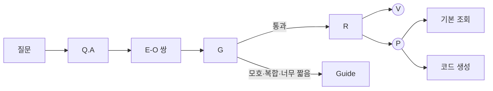

이 구조의 핵심은 Guard와 Router가 질문을 다시 해석하지 않고, Q.A가 만든 하나의 E-O 쌍을 공유한다는 점이다.

## E2. V3: LLM 기반 질문 분석과 안전한 JSON 실행

### 문제 1. 너무 강해진 정규식

V2.1과 V2.2에서 정규식을 계속 강화하면서 표현 하나가 여러 규칙에 동시에 걸리거나, 사용자의 실제 의도와 다른 E-O 쌍으로 분류되는 사례가 늘어났다.

예를 들어 `가장 많이 받은 사람의 학과를 알려줘`는 최댓값 계산과 필드 조회가 함께 필요하다. 단순 키워드 규칙은 `가장 많이`만 보고 최댓값 계산으로 끝내거나, `학과`만 보고 이름 조회로 잘못 분류할 수 있다.

### 문제 2. PANDAS 코드 생성 오류

PANDAS 분기의 기본 조회는 비교적 안정적이었지만, 기본 조회로 처리하지 못한 질문을 Python 코드로 생성하는 과정에서 유의미한 오류가 발견되었다.

- 존재하지 않는 컬럼 사용
- 문자열 금액을 숫자로 잘못 처리
- 선택하지 않은 문서의 DataFrame 접근
- 질문에 없는 조건 추가
- 잘못된 비교 연산과 정렬
- 임의 Python 코드 실행 위험

### 해결 1. Q.A를 정규식에서 LLM 분류로 전환

V3에서는 Q.A가 단순 정규식으로 E-O 쌍을 결정하는 대신, LLM이 허용된 질문 유형 중 하나를 구조화된 JSON으로 반환하도록 변경했다.

LLM은 자유롭게 `PANDAS` 또는 `VECTOR`라는 문자열을 선택하는 것이 아니라, `lookup_field`, `sum`, `max`, `document_criteria`처럼 허용된 operation만 선택한다. 이후 Guard와 Router가 이 operation을 실제 실행 경로로 변환한다.

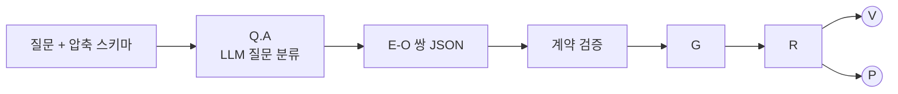

### 해결 2. Python 코드 대신 QueryPlan JSON 생성

PANDAS의 코드 생성 경로도 Python 코드를 직접 생성하는 방식에서, 허용된 연산만 담는 QueryPlan JSON 방식으로 변경했다.

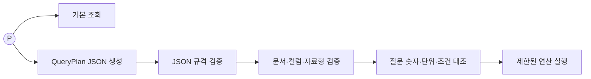

현재 허용되는 대표 연산은 `list`, `count`, `sum`, `mean`, `median`, `mode`, `min`, `max`다.

추가한 안전장치는 다음과 같다.

- 허용되지 않은 operation 거부
- 질문 원문에 없는 필터값 거부
- 존재하지 않는 문서와 컬럼 거부
- 선택 문서 범위를 벗어난 접근 거부
- 숫자·금액·날짜 자료형 불일치 거부
- JSON 오류 시 형식 수정 목적의 재시도 1회
- 검증 실패 시 임의 실행 대신 Guide 응답
- 기존 정규식 결과와 LLM 결과를 비교하는 shadow 모드

## E3. V4: 검증된 질문의 빠른 분류와 이중 JSON 구조

### 문제 1. 검증된 질문도 항상 LLM 분류를 거치는 문제

V3에서는 질문 분류를 LLM 기반으로 전환했지만, `49기 목록`, `홍길동이 낸 금액`, `2025년 3월 합계`처럼 표의 실제 컬럼과 값만으로 처리할 수 있는 검증된 질문도 LLM 호출을 거칠 수 있었다. 이 구조는 단순한 질문에도 응답 지연과 분류 결과의 변동 가능성을 만든다.

### 문제 2. 질문 분류와 실제 실행 계획의 역할이 혼동되는 문제

질문을 PANDAS와 VECTOR 중 어디로 보낼지 정하는 정보와, 어떤 데이터프레임에서 어떤 필터·집계·정렬을 실행할지 정하는 정보는 서로 다르다. 그러나 둘을 모두 JSON이라고만 부르면 분류 결과가 곧 실행 계획인 것처럼 오해하기 쉽다.

- `R.JSON`: 질문의 의도와 operation을 표현하며 최종 실행 모드를 고르는 **질문 분류 JSON**
- `P.JSON`: dataframe, filter, select, target, group, sort, limit 등을 표현하는 **실행 계획 JSON**

### 문제 3. 정규식 분류와 LLM 분류의 관계가 불분명한 문제

기존 정규식 기반 Q.A와 LLM 기반 Q.A가 동시에 존재하지만, LLM 모드에서 두 결과가 모두 실제 라우팅을 결정하는 것은 아니다. 정규식 결과는 기존 동작과의 차이를 확인하기 위한 shadow 비교 기준이며, 실제 분류 결과와 구분해서 기록해야 한다.

### 해결

#### 용어 정리

| 표기 | 의미 | 역할 |
|---|---|---|
| `pre-R` | Pre Router | 질문에서 자주 쓰는 표현을 먼저 확인하고, LLM 없이 처리할 수 있는지 시험하는 최초 진입점 |
| `D-P` | Deterministic Planner | 정규식이 제안한 operation 후보를 실제 스키마·메타데이터·원본 값에 대입해 안전한 `P.JSON`을 만들 수 있는지 검증하는 결정론적 Planner |
| `RE.QA` | Regular Expression Q.A | 기존의 전체 정규식 질문 분석기. 현재 LLM 모드에서는 실제 경로를 결정하지 않고 `LLM.QA`와 결과를 비교하는 shadow 기준으로 사용 |
| `LLM.QA` | LLM Question Analysis | `pre-R`와 `D-P`만으로 확정할 수 없는 질문을 해석해 `R.JSON`을 만드는 LLM 기반 질문 분석기 |
| `R.JSON` | Routing JSON | 질문의 operation과 상태를 담아 Guard와 Router가 PANDAS·VECTOR·GUIDE 중 경로를 결정하도록 하는 질문 분류 JSON |
| `P.JSON` | Plan JSON | 사용할 dataframe, filter, select, target, group, sort, limit 등 PANDAS가 실제로 수행할 작업을 담은 실행 계획 JSON |
| `operation` | 질문 작업 유형 | `lookup_amount`, `lookup_field`, `count_records`, `list_records`, `sum_amount`, `structured_query`처럼 질문이 요구하는 작업을 나타내는 값 |

여기서 `pre-R`의 일부 정규식과 `RE.QA`는 같은 것이 아니다. `pre-R`의 정규식은 자주 사용하는 질문에서 **operation 후보 하나를 빠르게 제안**하는 좁은 입구이고, `RE.QA`는 V1·V2에서 사용하던 기존 정규식 분석 전체를 가리킨다. 현재 LLM 모드에서 `RE.QA`는 실제 답변 경로가 아니라 비교용으로 남아 있다.

#### 검증된 operation 후보를 먼저 시험하는 구조

`pre-R`는 자주 사용하는 질문 표현을 정규식으로 확인해 operation 후보를 먼저 만든다. 하지만 정규식이 맞아 보인다는 이유만으로 그 후보를 확정하지 않는다. 후보를 `D-P`에 전달하고, `D-P`가 현재 데이터 구조에서 유효한 `P.JSON`을 실제로 만들었을 때만 해당 operation을 채택한다.

```text
정규식 = operation 후보 제안
D-P    = 실제 데이터와 스키마를 이용한 검증
```

따라서 이 구조는 “`P.JSON`을 만들 가능성이 높아 보이면 정규식으로 보낸다”가 아니라, “정규식으로 operation 후보를 고른 뒤 `D-P`가 `P.JSON` 생성에 성공한 경우에만 LLM 없는 경로를 확정한다”가 정확한 설명이다.

예를 들어 `김철수가 낸 금액 알려줘`라는 질문은 다음 순서로 처리된다.

1. `pre-R`가 `돈`, `금액`, `냈어`와 같은 표현을 감지한다.
2. `lookup_amount`를 operation 후보로 만든다.
3. `D-P`가 실제 표에 사람 이름 컬럼과 금액 컬럼이 있는지 확인한다.
4. 질문의 이름이 원본 값 또는 허용된 마스킹 이름과 대응하는지 확인한다.
5. 조건을 만족하는 `P.JSON` 생성에 성공하면 operation 후보를 확정한다.
6. 생성에 실패하면 정규식 후보를 버리고 `LLM.QA`가 `R.JSON`을 만들도록 넘긴다.

operation이 확정된 경우 `R.JSON`은 LLM이 생성하지 않는다. Python 코드가 검증된 operation과 질문 원문을 `QuestionDecision` 형식에 넣어 직접 조립한다.

```json
{
  "status": "ready",
  "requests": [
    {
      "source_text": "김철수가 낸 금액 알려줘",
      "operation": "lookup_amount"
    }
  ],
  "reason": "스키마와 질문 원문으로 검증 가능한 표 조회입니다."
}
```

즉, 이때의 `R.JSON`은 LLM이 새로 판단한 결과가 아니라 `D-P`로 검증된 operation을 기존 Guard·Router 계약에 맞게 포장한 결과다.

V4에서는 질문을 받으면 `pre-R`가 먼저 `D-P`를 호출한다. `D-P`가 현재 스키마와 메타데이터만으로 안전한 `P.JSON`을 만들 수 있는지를 확인하고, 만들 수 있다면 그 판단을 이용해 `pre-R`가 `R.JSON`을 직접 만든다. 이 경로에서는 `LLM.QA`를 호출하지 않는다.

`D-P`가 `P.JSON`을 만들 수 없는 질문만 `LLM.QA`로 보내 `R.JSON`을 생성한다. 이후에는 두 경로 모두 동일하게 Guard와 Router를 통과한다. Router가 PANDAS를 선택하면 실제 실행 단계에서 `P.JSON`을 생성·검증한 뒤 제한된 연산만 수행하고, VECTOR를 선택하면 문서 근거를 검색해 답변한다.

현재 `pre-R`에서 확인용으로 생성한 `P.JSON`은 실행 단계까지 전달하지 않는다. PANDAS 단계에서 `D-P`가 실제 `P.JSON`을 다시 만들며, 만들지 못하면 LLM Planner가 보완한다. 따라서 첫 번째 `P.JSON`은 빠르고 안전한 분류 가능성을 판단하는 근거이고, 두 번째 `P.JSON`이 검증 후 실제로 실행되는 계획이다.

`RE.QA`는 실제 라우팅 경로와 별도로 실행되는 shadow 비교용 경로다. `RE.QA`와 `LLM.QA`의 operation 차이는 비교 로그에 남기되, LLM 모드의 최종 경로를 `RE.QA`가 덮어쓰지는 않는다.

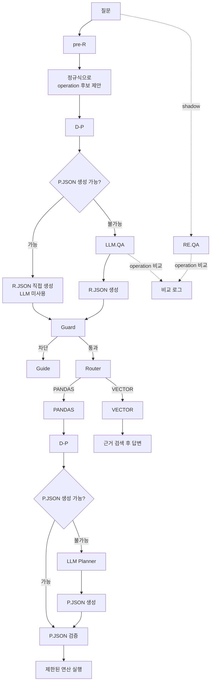

정리하면 `pre-R`는 LLM을 사용할지를 먼저 결정하고, `R.JSON`은 어디로 보낼지를 결정하며, `P.JSON`은 PANDAS가 무엇을 실행할지를 결정한다. 이 구조를 통해 검증된 질문은 빠르게 처리하면서도, 복잡한 질문에는 LLM의 판단 능력을 그대로 사용할 수 있다.

쉽게 비유하면 `D-P`라는 모의고사에서 `P.JSON` 생성에 성공한 질문만 LLM 시험을 생략하고 PANDAS라는 실제 시험장으로 직행시키는 구조다.

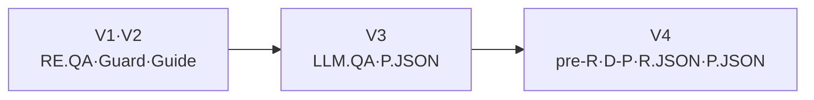

## E4. 골드셋 기반 세부 정확도 보완 계획

E4에서는 현재 라우팅 구조를 크게 변경하기보다 `Result_1.xlsx` 골드셋을 반복 실행하면서 라우팅·계획·실행 결과를 원본 데이터와 비교하고, 날짜·금액·이름·목록 조건처럼 남아 있는 사소한 오차를 회귀 테스트와 함께 수정할 계획이다.

---

# Part 3. 질문 답변 고도화

질문 답변 Part의 목표는 결과값만 보여 주는 것이 아니라, **같은 이름을 빠뜨리지 않고**, **출처와 계산 근거를 확인할 수 있으며**, **날짜 맥락까지 함께 이해할 수 있는 답변**을 만드는 것이다.

## E1. 동일 이름과 동명이인 처리

초기에는 이름 하나가 검색되면 첫 번째 결과만 답변할 가능성이 있었다. 하지만 장학재단 문서에서는 같은 사람이 여러 기수·연도·문서에 등장할 수 있고, 서로 다른 사람이 같은 이름을 사용할 수도 있다.

E1에서는 다음 원칙을 적용했다.

- 같은 이름의 항목이 여러 개면 모두 보여 준다.
- 동명이인이면 임의로 한 명을 선택하지 않는다.
- 기수, 발행번호, 문서명, 학과와 같은 주변 정보를 함께 표시한다.
- 여러 문서에서 같은 이름이 발견되면 문서 선택을 요청한다.
- 마스킹 이름도 가능한 후보를 한 건으로 단정하지 않고 함께 제시한다.

예를 들어 `김*수 찾아줘`라는 질문에 결과가 여러 개라면 한 행만 답하지 않고 다음과 같이 구분한다.

```text
김*수 검색 결과 3건
- 문서 A / 58기 / 정보컴퓨터공학부 / 지급액 1,000,000원
- 문서 A / 59기 / 기계공학부 / 지급액 800,000원
- 문서 B / 발행번호 2025-061 / 지급액 1,200,000원
```

## E2. 출처와 계산 근거를 포함한 답변

E2에서는 LLM을 사용한 답변과 PANDAS 계산 결과 모두에서 사용자가 결과를 검증할 수 있도록 근거 정보를 강화했다.

### VECTOR 답변

- 사용한 원본 문서
- 검색된 문서 청크
- 답변에 사용한 출처
- 문서에 직접 근거가 없는 경우 답변 제한

### PANDAS 답변

- 사용한 원본 문서
- 대상 컬럼
- 수행한 연산
- 조건에 일치한 행 수
- 실제 계산에 사용한 유효 행 수
- 제외된 행 수
- 적용한 날짜 조건

예시는 다음과 같다.

```text
총 출연금액: 977,070,000원

계산 근거
- 문서: test2025.png
- 대상 컬럼: 출연금액
- 계산: 합계
- 조건 일치 행: 160행
- 유효 행: 158행
- 제외 행: 2행
```

이 단계부터 답변의 목표는 단순히 그럴듯한 문장을 만드는 것이 아니라, 사용자가 원본 문서와 계산 과정을 다시 확인할 수 있게 만드는 것으로 바뀌었다.

## E3. 인물 카드와 금액 기록을 연결한 대화형 답변

E3에서는 답변 문장을 읽는 데서 끝나지 않고, 사용자가 답변 속 인물과 금액을 눌러 원본 기록을 직접 확인할 수 있도록 구조화된 대화형 응답을 연결했다.

- 인물 이름을 누르면 해당 인물의 상세 카드를 표시한다.
- 인물 카드는 `ocrConfidence` 같은 내부 메타데이터를 제외하고 실제 원본 데이터 컬럼만 보여 준다.
- 금액을 누르면 해당 금액이 계산되거나 조회된 원본 납부·지급 기록을 표시한다.
- 동일 인물의 기록이 여러 건이면 한 건으로 합치지 않고 행 단위로 구분한다.
- 인물과 금액의 연결 정보는 브라우저가 답변 문장을 다시 분석하지 않고 백엔드의 구조화된 API 응답으로 전달한다.
- 상세 기록이 많을 때도 확인할 수 있도록 페이지 단위 조회 구조를 사용한다.

이를 통해 사용자는 답변에 나온 이름과 금액이 어느 원본 행에서 나온 결과인지 바로 확인할 수 있다.

## E4. 검증된 후속 질문 자동 반환 계획

E4에서는 현재 질문과 응답에서 확인된 인물·금액·컬럼 정보를 기준으로, LLM을 거치지 않고 빠르게 실행할 수 있는 검증된 후속 질문을 자동 반환할 계획이다. 예를 들어 이름이 확인되면 `이 인물의 전체 기록`, `납부 금액`, `소속 정보`처럼 실제 스키마와 `D-P`로 실행 가능성이 검증된 질문만 추천하며, 문서별 이름이나 정답을 하드코딩하지 않는다.


---

## 4. 전체 고도화 구조

세 Part의 개선 결과를 하나의 흐름으로 합치면 다음과 같다.

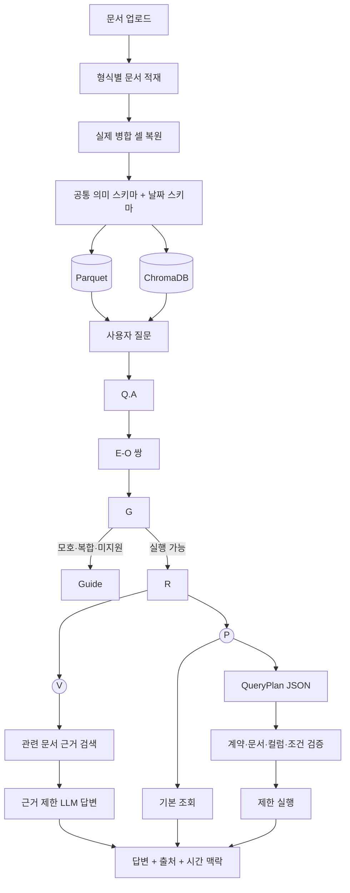

이 흐름에서 각 Part의 역할은 명확히 분리된다.

- **Part 1 문서 적재**는 질문에 사용할 수 있는 신뢰 가능한 데이터를 만든다.
- **Part 2 질문 분류**는 질문을 올바른 E-O 쌍과 실행 경로로 연결한다.
- **Part 3 질문 답변**은 결과와 함께 출처, 계산 근거, 날짜 맥락을 제공한다.

---

## 5. 현재 구현 구조

### 주요 저장소

| 저장소 | 역할 |
|---|---|
| Parquet | 표의 행·열을 구조화하여 PANDAS 조회에 사용 |
| `.schema.json` | 원본 컬럼의 의미·단위·날짜·민감도 메타데이터 저장 |
| ChromaDB | 문서 설명과 행 텍스트를 벡터로 저장 |
| PostgreSQL | 적재 상태와 중복 여부를 관리하는 manifest 저장 |

### 주요 모듈

| 영역 | 핵심 모듈 | 역할 |
|---|---|---|
| 문서 적재 | `utils/ingest.py` | 파일 형식별 적재 진입점 |
| 표 공통 처리 | `table_ingest_pipeline.py` | DataFrame형 표의 공통 정제·저장 |
| 의미 스키마 | `semantic_schema.py` | 원본 컬럼의 의미·단위·날짜 추론 |
| 질문 분석 | `question_analyzer.py`, `question_engine.py` | Q.A와 E-O 쌍 결정 |
| 질문 검수 | `guard.py`, `guide.py` | 모호·복합·미지원 질문 차단과 안내 |
| 실행 분기 | `router.py` | VECTOR, PANDAS, DOCUMENTS, GUIDE 선택 |
| PANDAS 기본 조회 | `datastore/query.py`, `aggregation.py` | 이름·명단·금액·날짜 조회 |
| PANDAS 계획 조회 | `query_plan.py`, `plan_validator.py`, `query_executor.py` | QueryPlan 생성·검증·실행 |
| VECTOR 검색 | `vector.py`, `prompts.py` | 근거 검색과 LLM 답변 |

---

## 6. 검증 방향

현재 프로젝트는 기능의 개수보다 실제 문서와 질문에서 얼마나 안정적으로 동작하는지를 중요하게 본다.

검증 지표는 다음과 같이 Part별로 나눈다.

| Part | 핵심 검증 항목 |
|---|---|
| 문서 적재 | 셀 OCR 정확도, 병합 셀 복원, 날짜·금액 스키마 정확도 |
| 질문 분류 | E-O 쌍 정확도, Guard 감지율, Router 분기 정확도 |
| 질문 답변 | 명단 누락 여부, 계산 정확도, 출처 일치 여부, 시간 조건 표시 |

현재 자동화 테스트는 질문 분석, Guard, Router, QueryPlan, 집계, 날짜, 문서 범위, 이름 검색, 스키마, 병합 셀, 이미지 OCR을 포함한다. 다음 단계에서는 실제 운영 문서별 골드셋을 만들고, 문서별·질문별 정답률과 실패 원인을 기록하는 방향으로 확장한다.

---

## 7. 실행 방법

### 환경 준비

```powershell
git clone https://github.com/goyojin/finance-doc-agent.git
cd finance-doc-agent
Copy-Item .env.example .env
Copy-Item .env.example backend/.env
```

```dotenv
POSTGRES_PASSWORD=change_me_secure_password
API_KEY=change_me_api_key
QUESTION_ENGINE_MODE=legacy
```

`QUESTION_ENGINE_MODE`는 다음 세 모드를 지원한다.

- `legacy`: 기존 정규식 Question Analyzer 사용
- `shadow`: 기존 결과로 실행하면서 LLM Q.A 결과를 비교
- `llm`: LLM Q.A의 구조화 operation을 실제 라우팅에 사용

### 인프라 실행

```powershell
docker compose up -d
```

```powershell
docker exec ollama_server ollama pull qwen2.5:3b
docker exec ollama_server ollama pull bge-m3
```

### 백엔드 실행

```powershell
cd backend
python -m venv venv
venv\Scripts\Activate.ps1
pip install -r ..\requirements.txt
uvicorn main:app --host 0.0.0.0 --port 8080 --reload
```

- 웹 UI: `http://localhost:8080/ui`
- Swagger UI: `http://localhost:8080/docs`
- 상태 확인: `http://localhost:8080/health`

---

## 8. 대표 질문 예시

### PANDAS 기본 조회

```text
선택한 문서의 전체 명단을 보여줘
58기 기부자 명단을 알려줘
홍길동의 학과와 지급액을 알려줘
3~4월 출연금액 합계 알려줘
가장 많이 받은 사람은 누구야?
```

### PANDAS QueryPlan

```text
3월에 지급액이 100만원 이상인 사람을 금액순으로 보여줘
2025년 4월 장학생 중 상위 5명을 알려줘
기수별 평균 지급액을 비교해줘
```

### VECTOR

```text
이 장학금의 지급 기준을 설명해줘
문서에 적힌 신청 절차가 뭐야?
지원 대상 조건을 근거와 함께 알려줘
```

### GUIDE가 필요한 질문

```text
저번 거 얼마야?
그 사람 알려줘
금액이랑 규정 전부 비교해줘
```

---

## 9. 최종 목표

이 프로젝트의 최종 목표는 문서를 많이 읽는 에이전트가 아니라, **장학재단 문서를 안전하게 적재하고, 질문 의도를 정확히 분류하며, 사용자가 검증할 수 있는 근거와 함께 답하는 업무형 에이전트**를 만드는 것이다.

고도화의 기준은 다음 세 문장으로 정리할 수 있다.

> 문서 적재 단계에서는 원본 구조를 임의로 바꾸지 않는다.  
> 질문 분류 단계에서는 확신할 수 없는 요청을 임의로 실행하지 않는다.  
> 질문 답변 단계에서는 결과만 보여 주지 않고 근거와 시간 맥락을 함께 제공한다.
