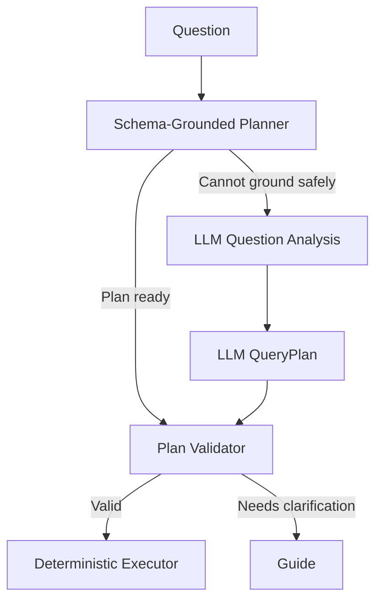

# Question Routing and Document Search

이 문서는 기존 README의 Part 2 질문 분류 고도화 기록과 현재 질문 처리 구조를 정리합니다.

## 현재 역할

`rag/`는 사용자의 질문을 다음 기능 중 하나로 연결합니다.

- 문서 목록
- 구조화된 표 조회
- 인물 금액 또는 필드 조회
- 집계와 순위 계산
- 문서 목적·기준·절차 검색
- 질문 명확화 안내

## E1. V1~V2.2 규칙 기반 분류

초기 Router는 키워드와 정규식으로 PANDAS와 VECTOR를 나눴습니다. 이후 합계, 평균, 명단, 인물 조회 같은 질문을 안정적으로 분류하기 위해 Regex Question Analyzer와 Engine-Operation Pair를 도입했습니다.

이 단계에서 얻은 핵심 원칙은 다음과 같습니다.

- Router는 답을 만들지 않고 실행 경로만 선택
- operation은 사용자가 원하는 작업을 표현
- 금액·명단 같은 검증된 질문은 LLM 없이 처리 가능
- 모호하거나 복합적인 질문은 GUIDE로 안내

## E2. V3 LLM 질문 분석과 안전한 JSON

정규식 범위가 커지면서 서로 다른 표현이 충돌하고 유지보수가 어려워졌습니다. 이를 해결하기 위해 LLM이 질문을 구조화된 분류 JSON으로 만들도록 확장했습니다.

또한 LLM이 임의 Python 코드를 생성하는 방식 대신 제한된 Query Execution Plan JSON을 생성하도록 변경했습니다.

```text
질문
→ Question Decision JSON
→ QueryPlan JSON
→ 검증
→ 결정적 실행
```

LLM 출력은 바로 실행하지 않습니다. 실제 DataFrame, 컬럼, 연산자, 자료형, 질문 원문 근거와 일치하는지 검증합니다.

## E3. V4 검증된 질문의 빠른 처리

자주 쓰는 질문까지 항상 LLM 분류를 거치면 느리고 결과 변동성이 생깁니다. 그래서 이미 검증된 operation 후보를 먼저 스키마에 대입해 실행 가능한지 확인했습니다.

당시 문서에서 사용한 개념:

| 기존 약칭 | 현재 의미 |
|---|---|
| Pre-R | Fast question classification |
| RE.QA | Regex-based question analysis |
| LLM.QA | LLM-based question analysis |
| R.JSON | Question Decision JSON |
| D-P | Deterministic Planner |
| P.JSON | Query Execution Plan JSON |

비유하면 “모의고사 계획이 실제 시험 조건을 통과하면 같은 계획으로 바로 시험장에 들어가고, 통과하지 못할 때만 추가 판단을 받는 구조”입니다.

## E4. V5 단일 Schema-Grounded Planning Boundary

V4에서는 빠른 패턴 판별과 Deterministic Planner의 책임이 겹쳤고, 검증용으로 만든 계획을 다시 생성하는 중복이 있었습니다.

V5에서는 `build_auto_schema_grounded_plan()`을 빠른 질문 처리의 단일 경계로 사용합니다.



주요 변화:

- operation 판단과 계획 생성을 한곳에서 수행
- 처음 만든 QueryPlan을 실제 실행에 재사용
- 이름, 마스킹 이름, 날짜 범위 경계 검증 통합
- 다중 금액 컬럼은 질문으로 특정되지 않으면 첫 컬럼을 선택하지 않음
- 빠른 계획이 불가능한 질문만 LLM 분석으로 이동

## VECTOR 문서 검색

목적, 기준, 절차, 이유처럼 표 계산으로 답할 수 없는 질문은 ChromaDB에서 관련 문서 청크를 검색합니다.

```text
질문
→ 검색어 확장
→ 선택 문서 범위 안에서 유사도 검색
→ 관련도 기준 통과 문서 선택
→ 검색 근거와 질문을 LLM에 전달
→ 답변
```

검색 결과에 근거가 없으면 일반 지식이나 파일명으로 내용을 추측하지 않습니다.

## 자동완성

자동완성 카탈로그는 현재 문서 스키마에서 실제로 계획을 만들 수 있는 질문만 반환합니다.

- 기본 E-O operation 질문
- 문서에 존재하는 인물 이름과 가능한 조회 동작
- 완전한 날짜 또는 연도·월 구조에서 가능한 날짜 질문
- 브라우저가 로컬에서 접두사를 비교하므로 키 입력마다 API나 LLM을 호출하지 않음

## 개인정보 보호 로그

질문 원문과 확장 검색어는 로그에 남기지 않습니다.

```text
question_id=<12자리 해시>
chars=<질문 길이>
route=<실행 경로>
error_type=<예외 클래스>
```

## 주요 파일

| 파일 | 역할 |
|---|---|
| `question_engine.py` | LLM Question Decision |
| `question_decision.py` | 질문 분류 JSON 계약 |
| `deterministic_query_plan.py` | 스키마 기반 빠른 계획 |
| `query_planner.py` | LLM QueryPlan 생성 |
| `guard.py` | 복합·위험·모호 질문 차단 |
| `router.py` | operation을 실행 엔진으로 연결 |
| `pandas_rag.py` | PANDAS 처리 흐름 |
| `vector.py` | ChromaDB 검색과 답변 |
| `question_suggestions.py` | 자동완성 카탈로그 |

